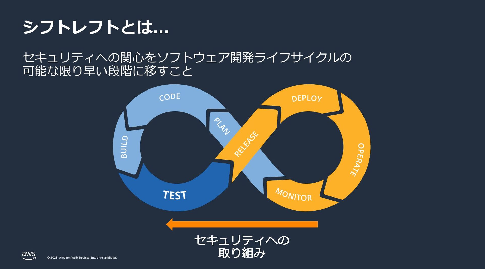
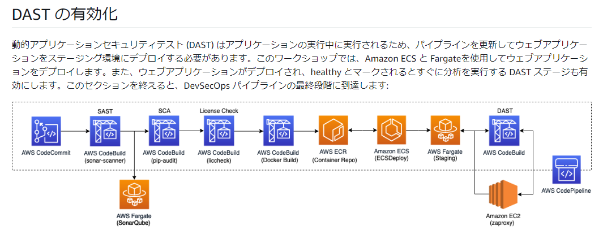

# Security-JAWSってどんなもの？

AWSのUserGroupの一つで、Securityをメインに新機能について共有や、LT会等を不定期に行っています。
この日の動画はYoutubeにも上がっています。
[動画はこちら](https://www.youtube.com/live/8NIpg1uGUSk?feature=share)

# ハンズオン内容

当日のハンズオンは以下のものです。（更新されるまでは）いつでも出来るので興味があればぜひやってみてください。
[Security for Developers](https://catalog.workshops.aws/sec4devs/ja-JP/module1)

概要としては、AWS CDKを利用してパイプラインを作成し、脆弱性を含んだコンテナをデプロイします。
OSSの脆弱性チェックツールを用いて修正点を見つけながら、コンテナのCICDを改善していくというシナリオです。
費用としては、数十円程度かかります。

# セミナー概要

セミナー資料はこちら。

https://speakerdeck.com/kanamasa/ship-securely

まずはセキュリティの考え方についてAWSの金森さんから講義がありました。
ポイントとしては以下です。

* セキュリティの関心をデプロイ前に向かってシフトレフトさせる
* 早期に解決する方がコストが下がる
* セキュアに実装するためのポイントは多岐にわたっている
* パイプラインの中で静的・動的コード解析や脆弱性テスト、ペネトレーションテストを行う事で自動化する

## 脅威モデリングとは

**潜在的なセキュリティ問題をある程度特定するための設計時のアクティビティ**

つまり、どんな脅威が存在するかを定義するアクティビティです。
どんなアクターに、どんな脅威を持っていて、その軽減策は何かといったことを、単に表形式で表現したり、データフロー図に表現したりします。
最も成熟した方法の一つは ***STRIDE*** だそうです。（正直セキュリティ知識が無いので初めて知りました。。。）

## IDEセキュリティプラグインとは

脅威モデリングで潜在的な問題をクリアにしても、コードを実装するときに混入しては意味がないです。
そのため、コーディング時にリスクの混入を防ぐために、普段使っているIDEにプラグインとしてセキュリティツールを入れましょう。
最近では、***snyk***というツールが有名です。

## ソースコントロールでのセキュリティ

コード管理するときに、アクセスキーやトークンを漏洩してしまうのは非常にまずいです。
そのため、Commitする際に自動的に検知される仕組みを導入しましょう。
***git-secret***や ***GitHound***等が存在しています。

認証情報の保管は、***AWS Secrets Manager*** 等のサービス・ツールを利用することで、コード内に認証情報を残す必要が無くなり、よりセキュアなアプリケーションが作成出来ます。

## 静的アプリケーションセキュリティテスト(SAST)

開発したコードに対して脆弱性が無いか分析するテストです。
例えば、***SQLインジェクション*** や***XSS*** 、***安全ではないライブラリ*** の検出が可能です。
ただし、誤検知については人手での確認が必要です。検知された物を正しく判断することが大切です。

## ソフトウェア構成解析(SCA)

ソフトウェアに導入されている3rdパーティライブラリの脆弱性をチェックします。
必ずと言って良いほどライブラリを利用してソフトウェアを実装しているので、脆弱性のあるライブラリを利用していないか確認することは非常に重要です。

## ライセンスチェック

会社で特定のライセンスのみ許可している場合等、ライセンス違反を起こさないためにも管理が必要です。

## 動的アプリケーションセキュリティテスト(DAST)

最終的にデプロイされたソフトウェアのセキュリティをチェックします。
SASTと組み合わせて実行することでよりセキュアなアプリケーションにすることが可能です。
SASTと比較して誤検知を除去していくことで、自動化プロセスを改善することが出来ます。

# ハンズオン概要

AWS CDKを利用して、Code Pipelineを実装し、そのパイプラインの中で ***SAST*** ,***SCA***,***Lisence Check***を実施したコンテナをデプロイします。
今回はSASTツールとして ***SonarQube Server*** 、DASTツールとして ***OWSAP Zap***を利用します。どちらもOSSのものになります。

所要時間はかなりゆっくりとやって3時間程度でした。

流れとしては以下のようになっています。
 1. パイプラインの作成
 2. 脆弱性たっぷりのコンテナをデプロイ
 3. 脆弱性に対して実際に疑似的な攻撃をしかける
 4. SonarQubeを利用したSASTをパイプラインに導入する
 5. SonarQubeで検知された脆弱性について、内容を確認する
 6. pip-auditを利用したSCAをパイプラインで検知する
 7. liccheckを利用したライセンス分析をパイプラインで実行する
 8. OWASP Zed Attack Proxyを利用してDASTをパイプラインに導入する

これによってDevSecOpsを実行するパイプラインをCDKで構築しながら、各フェーズで対応すべきセキュリティ対策について実際の検出メッセージも合わせて確認することが出来ます。

# 感想

昨今話題性のあるDevSecOpsについて、実際にパイプラインの作成と脆弱性を排除する一連の流れを体験することができ、非常に学びの多い会でした。
自動化やセキュリティは必須事項になってきているので、構築して身に付けることが出来るこのハンズオンは、一度はやっておいても損はないと感じました。
ぜひ一度お試しください！

今後は応用しながら自分のパイプラインを見直していきたいと思います。
CodeCatalystとも合わせて検証していきたいですね。